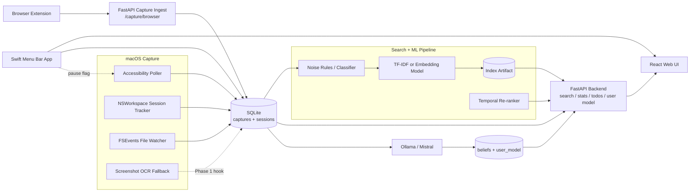

# MemoryOS Architecture

MemoryOS is designed as a local-first system. Sensitive capture, storage, indexing, and search run on the user's machine by default. Hosted UI pieces are optional shells over local APIs.

## Components

### macOS daemon

Location: `daemon/`

The daemon is responsible for passive capture:

- Accessibility polling reads visible text from the focused window.
- `NSWorkspace` session tracking records which app is active and for how long.
- FSEvents watches common user folders for edited or opened files.
- Screenshot OCR is planned as a signed-app fallback for apps that block Accessibility.

The daemon writes directly to SQLite.

The daemon also honors `~/Library/Application Support/MemoryOS/capture.paused`, which lets the menu bar app pause local capture without stopping the process.

### Browser extension

Location: `extension/`

The Chrome extension captures page title, URL, and visible body text after the user has remained on a page for at least 45 seconds. It posts captures to a localhost ingest endpoint. Incognito tabs, obvious sensitive domains, common entertainment domains, and very short pages are skipped.

### Browser capture ingest

The Chrome extension posts directly to the local FastAPI backend:

```text
POST http://127.0.0.1:8765/capture/browser
```

It writes rows to the same SQLite `captures` table used by the daemon.

### SQLite store

Reference schema: `docs/schema.sql`

SQLite stores local MemoryOS state:

- `captures`: captured content and metadata.
- `sessions`: app usage sessions.
- `search_clicks`: opened search results and dwell signals.
- `todos`: follow-up tasks.
- `beliefs`, `user_model`, and `abstraction_runs`: Phase 7 local user-model state.

The schema also tracks `is_noise`, `is_pinned`, and optional embedding data.

### Search and ML pipeline

Location: `ml/`

Current responsibilities:

- Build a TF-IDF index by default.
- Optionally use sentence-transformer and FAISS after installing embedding extras.
- Label captures as useful or noise.
- Train a noise classifier and temporal re-ranker from local labels/clicks.
- Generate candidate pairs and fine-tune an embedder for future semantic search.

### Search backend

Location: `backend/`

Backend responsibilities:

- Serve local search through FastAPI.
- Load the TF-IDF, sentence-transformer, or FAISS index.
- Fetch metadata from SQLite.
- Expose search, stats, recent captures, collections, digest, todos, storage, privacy, export/delete, and Phase 7 user-model endpoints.
- Refresh the index through `/refresh-index`.
- Accept browser capture ingest through `/capture/browser`.
- Trigger macOS `open` for captured URLs and file paths through `/open`.

### Web UI

Location: `web/`

Web UI responsibilities:

- Search interface.
- Result cards and filters.
- Stats dashboard.
- Click logging for re-ranker labels.
- Manual keep/noise labeling.
- Smart collections, weekly digest, todos, and user model.
- Storage cleanup, privacy settings, backend settings, and index refresh.

### Menu bar app

Location: `menubar/`

The Swift menu bar app shows backend status, opens the web UI, refreshes the index, pauses capture, and walks the user through Accessibility, Full Disk Access, and Screen Recording fallback permissions.

### Local user model

Location: `backend/abstraction_engine.py`

Phase 7 runs every 6 hours through `com.memoryos.scheduler`. It reads recent non-noise captures, calls local Ollama/Mistral in JSON mode, stores structured beliefs, and renders the result in the You tab.

### Installer

Location: `scripts/install_memoryos.sh`

The installer is the supported first-run path. It copies app files to `~/Library/Application Support/MemoryOS/app`, installs dependencies, builds the web/native apps, starts Ollama, pulls `mistral` if needed, registers launch agents, verifies services, and opens the web UI.

## Data Flow



## Privacy Boundaries

- Backend services bind to `127.0.0.1`.
- Captures are stored locally by default.
- Sensitive apps and domains are blocked early.
- The future menu bar app should expose pause/resume and forget controls.
- Privacy settings are stored locally in `~/Library/Application Support/MemoryOS/privacy.json`.
- Export and forget/delete controls are served by the local backend.

## Build Assumptions

- macOS with matching Xcode or Command Line Tools.
- Swift compiler for the daemon.
- Python 3.11+ for scripts and future ML work.
- Node 18+ for future web work.

## Packaging

- `scripts/build_daemon.sh` builds the Swift daemon.
- `scripts/build_menubar.sh` builds `menubar/dist/MemoryOS.app`.
- `scripts/install_daemon_launch_agent.sh` installs daemon launch at login.
- `scripts/install_menubar_launch_agent.sh` installs menu bar launch at login.
