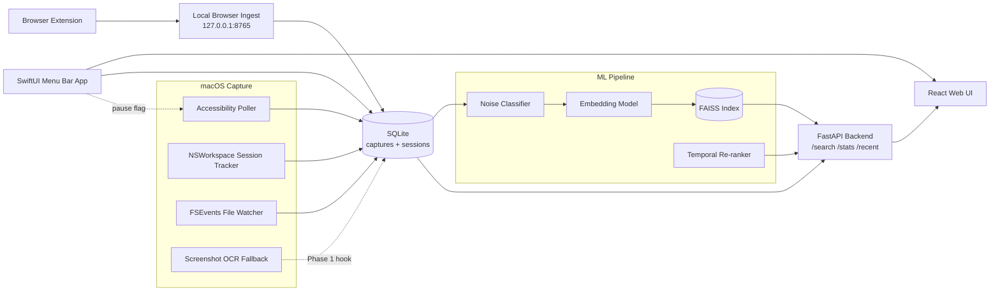

# MemoryOS Architecture

MemoryOS is designed as a local-first system. Sensitive capture, storage, indexing, and search run on the user's machine by default. Hosted UI pieces are optional shells over local APIs.

## Components

### macOS daemon

Location: `daemon/`

The daemon is responsible for passive capture:

- Accessibility polling reads visible text from the focused window.
- `NSWorkspace` session tracking records which app is active and for how long.
- FSEvents watches common user folders for edited or opened files.
- Screenshot OCR is planned as a signed-app fallback for apps that block Accessibility.

The daemon writes directly to SQLite.

The daemon also honors `~/Library/Application Support/MemoryOS/capture.paused`, which lets the menu bar app pause local capture without stopping the process.

### Browser extension

Location: `extension/`

The Chrome extension captures page title, URL, and visible body text after the user has remained on a page for at least 45 seconds. It posts captures to a localhost ingest endpoint. Incognito tabs, obvious sensitive domains, common entertainment domains, and very short pages are skipped.

### Browser ingest server

Location: `scripts/browser_ingest_server.py`

This lightweight local server accepts browser captures at:

```text
POST http://127.0.0.1:8765/capture/browser
```

It writes rows to the same SQLite `captures` table used by the daemon.

### SQLite store

Reference schema: `docs/schema.sql`

SQLite stores two core entities:

- `captures`: captured content and metadata.
- `sessions`: app usage sessions.

The schema leaves room for Phase 2 ML outputs with `is_noise` and `embedding` columns.

### ML pipeline

Location: `ml/`

Planned Phase 2 responsibilities:

- Label captures as useful or noise.
- Train a noise classifier.
- Fine-tune a sentence-transformer embedding model.
- Build and refresh a FAISS vector index.
- Train a re-ranker after click data exists.

### Search backend

Location: `backend/`

Phase 3 responsibilities:

- Serve semantic search through FastAPI.
- Load the embedding model and FAISS index.
- Fetch metadata from SQLite.
- Expose `/search`, `/stats`, and `/recent`.
- Refresh the index through `/refresh-index`.
- Accept browser capture ingest through `/capture/browser`.

### Web UI

Location: `web/`

Phase 4 responsibilities:

- Search interface.
- Result cards and filters.
- Stats dashboard.
- Click logging for re-ranker labels.
- Manual keep/noise labeling.
- Backend settings and index refresh.

## Data Flow



## Privacy Boundaries

- Backend services bind to `127.0.0.1`.
- Captures are stored locally by default.
- Sensitive apps and domains are blocked early.
- The future menu bar app should expose pause/resume and forget controls.
- Privacy settings are stored locally in `~/Library/Application Support/MemoryOS/privacy.json`.
- Export and forget/delete controls are served by the local backend.

## Build Assumptions

- macOS with matching Xcode or Command Line Tools.
- Swift compiler for the daemon.
- Python 3.11+ for scripts and future ML work.
- Node 18+ for future web work.

## Packaging

- `scripts/build_daemon.sh` builds the Swift daemon.
- `scripts/build_menubar.sh` builds `menubar/dist/MemoryOS.app`.
- `scripts/install_daemon_launch_agent.sh` installs daemon launch at login.
- `scripts/install_menubar_launch_agent.sh` installs menu bar launch at login.
